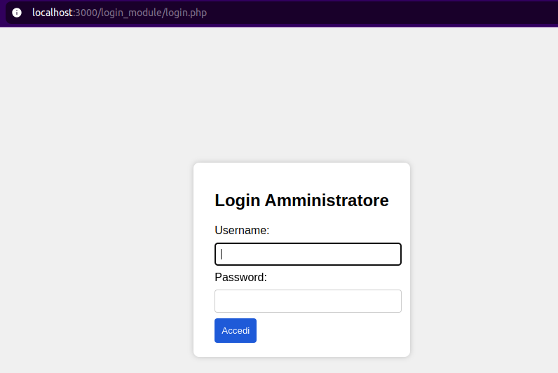
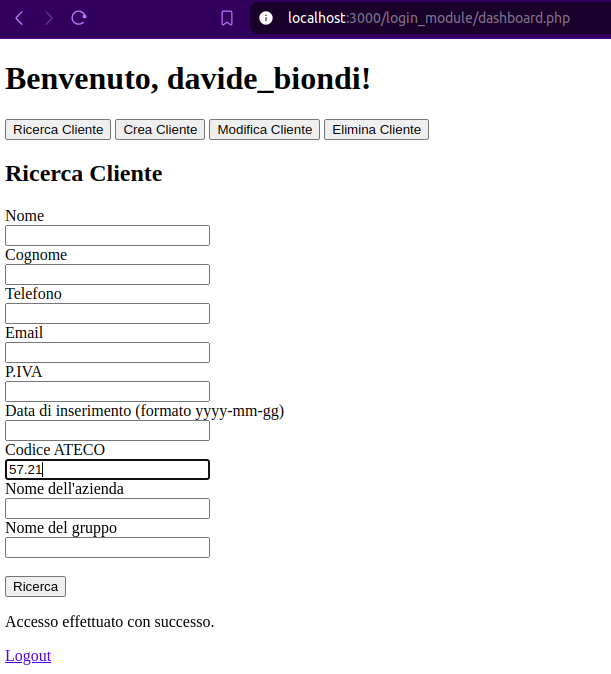
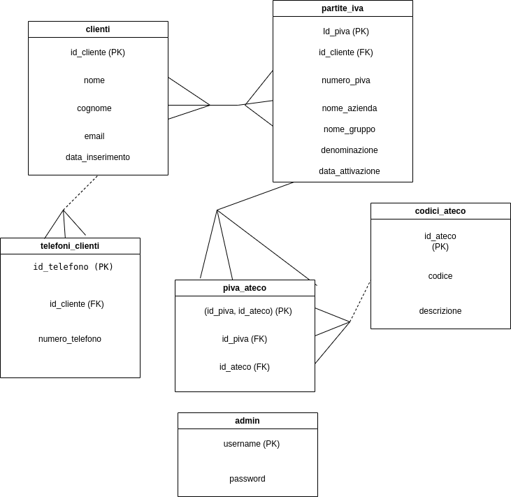

# Top Soft Task

A multi-module project integrating PHP, SQL, Bash scripting. 
The goal of **Top Soft Task** is to provide an end-to-end demonstration of a complete software workflow: 
from backend authentication logic, to database management, to automated indexing of research data, 
and future integration with external APIs.

### **1. PHP WebApp – Login Module**

- User authentication
- Commented documentation on every token used (`php_webapp/login_module/comments.txt`)

### **2. Database Layer (MySQL)**
SQL schema including:
- Users table
- Relational integrity rules

### **3. Analytical Indexing Tools**
Shell utilities to:
- Process CSV files
- Generate an **indice analitico** (analytical index)
- Validate citations (keeping every single one under 100 words)

## Screenshots

### **4. Hosted on Render**
[PHP App Cloud hosted website] (https://topsoft-task-latest.onrender.com/login.php)

